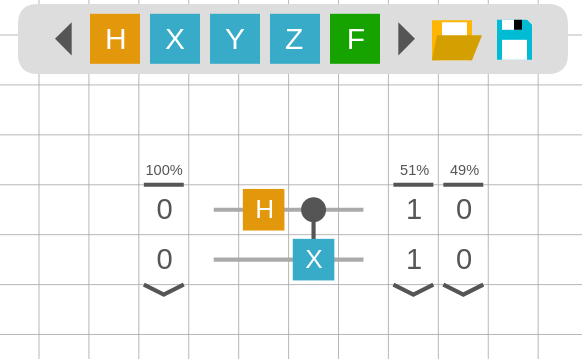

# Agate
An open-source quantum circuit designer and simulator.

View the GitHub hosted version here: https://lumorti.github.io/Agate/

Agate exists as a single portable HTML file with no dependencies, as such it can be downloaded for easy offline access.

### Features
* support for H, X, Y, Z, S, T and swap gates, plus custom gates and any number of controls
* support for custom text objects for labelling circuits (allowing links and some LaTeX)
* contains a number of circuit presets (Tutorials, Grover's, more to come)
* can read/write QASM files, both 2.0 and 3.0
* can export as SVG
* page URL is updated with the QASM for easy sharing
* optimised for both mobile and desktop

### Embedding

By adding "view" before "OPENQASM" in the sharable URL (so it becomes "#viewOPENQASM..."), the resulting page will be put into no-edit mode. This is designed to allow such links to be better embedded in pages as iframes. I'd put one here to show you, but GitHub markdown doesn't allow them.

